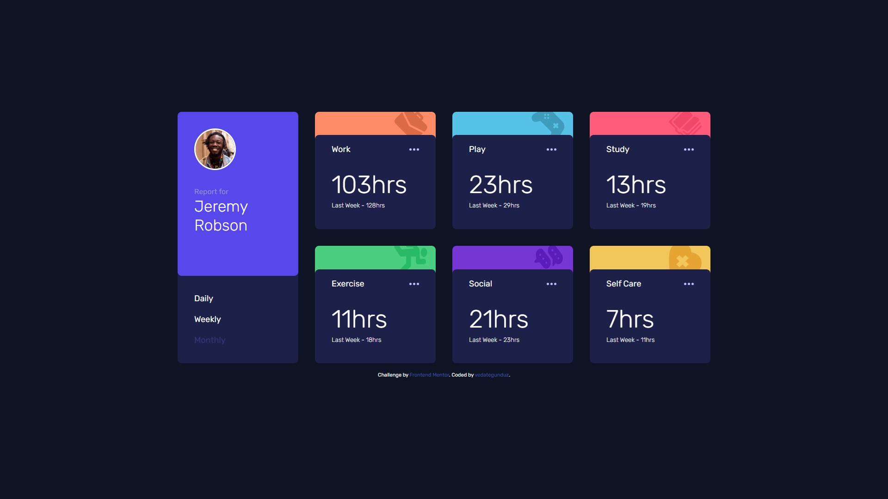

# Frontend Mentor - Time Tracking Dashboard Solution

This is my solution to the [Time Tracking Dashboard challenge on Frontend Mentor](https://www.frontendmentor.io/challenges/time-tracking-dashboard-UIQ7167Jw). This project helped me strengthen my skills in handling JSON data, dynamic DOM manipulation, and responsive design workflows.

## Table of Contents

- [Overview](#overview)
  - [The Challenge](#the-challenge)
  - [Screenshot](#screenshot)
  - [Links](#links)
- [My Process](#my-process)
  - [Built With](#built-with)
  - [What I Learned](#what-i-learned)
  - [Future Improvements](#future-improvements)
- [Author](#author)

---

## Overview

### The Challenge

Users should be able to:

- View the optimal layout based on their device's screen size
- See hover states on all interactive elements
- Switch between Daily, Weekly, and Monthly timeframes

### Screenshot



### Links

- 🛠️ [Solution on GitHub](https://github.com/vedategunduz/frontend-mentor-challenges/tree/main/time-tracking-dashboard-main)
- 🌐 [Live Site Demo](https://vedategunduz.github.io/frontend-mentor-challenges/time-tracking-dashboard-main/)

---

## My Process

### Built With

- Semantic HTML5
- CSS Custom Properties
- Flexbox & CSS Grid
- Mobile-first workflow
- Vanilla JavaScript (no frameworks)
- JSON data fetch & DOM rendering

### What I Learned

- How to dynamically fetch and parse JSON data using `fetch()`
- How to update the DOM using data attributes
- Handling active state classes and user interactions
- Building a clean and responsive layout for all screen sizes

```js
cards.forEach((c, i) => {
  const item = data[i];
  setCardData(c, {
    title: item.title,
    current: item.timeframes[time].current,
    previous: item.timeframes[time].previous
  });
});
```

### Future Improvements

- Add dark mode toggle
- Add animations for cards (slide/fade)
- Store selected timeframe in localStorage
- Improve accessibility with ARIA roles and labels

---

## Author

- Name: **Vedat Emre Gündüz**
- Frontend Mentor: [@vedategunduz](https://www.frontendmentor.io/profile/vedategunduz)
- GitHub: [@vedategunduz](https://github.com/vedategunduz)
